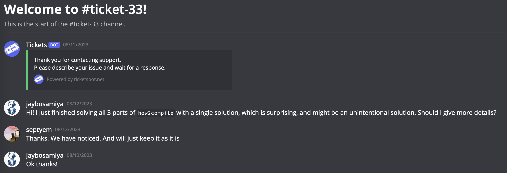

# How2Compile

Writeup by [Jay Bosamiya](https://www.jaybosamiya.com/)

How2Compile was a series of 4 reversing challenges: `how2compile-high`, `how2compile-mid`, `how2compile-low` and `how2compile-allinone`.

## Description

The first 3 challenges had the text: "The flag is in HIR", "The flag is in MIR", and "The flag is in LIR" respectively, along with all being on the same port `nc chall.ctf.0ops.sjtu.cn 30002` and having the same [download]([download](./how2compile_7e4f6a5038e2ae91146106bf707a0eea.zip).

The last challenge, `how2compile-allinone` was released later in the contest, and had the description:

> Something went wrong and I'm trying to fix it :(
>
> So just resend your previous 3 payloads, and concat them you'll get the flag
> 
> `nc chall.ctf.0ops.sjtu.cn 30003`
>
> [download](how2compile_fixed_bf935dd243206ab06b6035173dbe1582.zip)

To the best of our understanding, the `how2compile-allinone` challenge was
released because there was a challenge-breaking flaw with the initially released
3 challenges (high, mid, low). We reported this issue to them (described below),
and they decided to keep up the challenges along with the associated points;
then released the version later on that fixed it.

## What is the challenge doing?

Looking at the initial release
[zip](./how2compile_7e4f6a5038e2ae91146106bf707a0eea.zip), we find two files:
`wrapper.sh` that just runs `rustup run nightly-2023-11-03 ./task 2>/dev/null`,
and `task` which is the actual binary.

Starting purely with blackbox analysis, trying to run the file, we notice that
it complains about missing libraries related to rustc. This must be why the
`rustup run ...` is necessary. Running it with that, the exact version of the
rust compiler is pulled and the binary can link against it to execute. This
already tells us that the Rust compiler is involved. More specifically, the Rust
compiler is being used as a library in this program.

When we execute it, it complains about missing the files `flagh.txt`,
`flagm.txt` and `flagl.txt`, where we add in fake placeholder flags to have it
continue executing. `RUST_BACKTRACE=1` at those points gives nothing immediately
useful.

Once we can execute it, it asks for `code:` and waits and waits for user input.
Sending it `/dev/urandom` shows that we need valid UTF-8. Manually mashing the
keyboard for quite a while and sending it lots of "AAAAAA..." shows that it does
not stop waiting for user input. Cool, this indicates that we're missing a
terminator somewhere. Pulling it up inside Binary Ninja, we notice that there is
a string `[END]` visible (could've found this with `strings` too). If we the
program `[END]`, we now get a menu:

```
1. print HIR
2. print MIR
3. print LIR
```

We can test out each of these options to see what we get:

```console
$ rustup run nightly-2023-11-03 ./task
code:
[END]
1. print HIR
2. print MIR
3. print LIR
1
Item { ident: #0, owner_id: DefId(0:1 ~ rust_out[5675]::{use#0}), kind: Use(Path { span: no-location (#1), res: [Err], segments: [PathSegment { ident: {{root}}#1, hir_id: HirId(DefId(0:1 ~ rust_out[5675]::{use#0}).1), res: Err, args: None, infer_args: false }, PathSegment { ident: std#1, hir_id: HirId(DefId(0:1 ~ rust_out[5675]::{use#0}).2), res: Def(Mod, DefId(1:0 ~ std[85ad])), args: None, infer_args: false }, PathSegment { ident: prelude#1, hir_id: HirId(DefId(0:1 ~ rust_out[5675]::{use#0}).3), res: Def(Mod, DefId(1:47 ~ std[85ad]::prelude)), args: None, infer_args: false }, PathSegment { ident: rust_2015#1, hir_id: HirId(DefId(0:1 ~ rust_out[5675]::{use#0}).4), res: Def(Mod, DefId(1:130 ~ std[85ad]::prelude::rust_2015)), args: None, infer_args: false }] }, Glob), span: no-location (#1), vis_span: no-location (#1) }
Item { ident: std#2, owner_id: DefId(0:2 ~ rust_out[5675]::std), kind: ExternCrate(None), span: no-location (#1), vis_span: no-location (#1) }

$ rustup run nightly-2023-11-03 ./task
code:
[END]
1. print HIR
2. print MIR
3. print LIR
2

$ rustup run nightly-2023-11-03 ./task
code:
[END]
1. print HIR
2. print MIR
3. print LIR
3
Not implemented :(
```

So clearly we have some output showing up from HIR. MIR printed nothing, but
that looks like it might've been optimized out, and LIR seems to be actively
disallowed using their "Not implemented :(". This is somewhat unsurprising since
the Rust compiler has [HIR](https://rustc-dev-guide.rust-lang.org/hir.html) and
[MIR](https://rustc-dev-guide.rust-lang.org/mir/index.html), but there isn't
something directly called LIR (at least that I'm aware of).

Sending an actual Rust program confirms this by showing MIR as well:

```console
$ rustup run nightly-2023-11-03 ./task
code:
fn foo() {}
[END]
1. print HIR
2. print MIR
3. print LIR
2
Body { basic_blocks: BasicBlocks { basic_blocks: [BasicBlockData { statements: [], terminator: Some(Terminator { source_info: SourceInfo { span: <main.rs>:1:12: 1:12 (#0), scope: scope[0] }, kind: return }), is_cleanup: false }], cache: Cache { predecessors: OnceCell(<uninit>), switch_sources: OnceCell(<uninit>), is_cyclic: OnceCell(false), reverse_postorder: OnceCell([bb0]), dominators: OnceCell(<uninit>) } }, phase: Runtime(Optimized), pass_count: 1, source: MirSource { instance: Item(DefId(0:3 ~ rust_out[5675]::foo)), promoted: None }, source_scopes: [SourceScopeData { span: <main.rs>:1:1: 1:12 (#0), parent_scope: None, inlined: None, inlined_parent_scope: None, local_data: Set(SourceScopeLocalData { lint_root: HirId(DefId(0:3 ~ rust_out[5675]::foo).0), safety: Safe }) }], coroutine: None, local_decls: [LocalDecl { mutability: Mut, local_info: Clear, ty: (), user_ty: None, source_info: SourceInfo { span: <main.rs>:1:9: 1:9 (#0), scope: scope[0] } }], user_type_annotations: [], arg_count: 0, spread_arg: None, var_debug_info: [], span: <main.rs>:1:1: 1:12 (#0), required_consts: [], is_polymorphic: false, injection_phase: None, tainted_by_errors: None, function_coverage_info: None }
```

Cool, now we've understood (at least roughly) what the program is doing, and
what our goal is. Specifically, we can infer that there is likely information
placed from the `flag*.txt` files placed into various stages of HIR, MIR, and
LIR, and the goal is to expose this information from the compilation outputs we
are able to get.

## Triple Attack


I didn't yet want to start reversing the code (it's Rust code, can be reversed,
but more painful than C reversing, and I am being lazy), so I start testing a
few things out locally.

The first few things I try involve just confirming whether various Rust features
are compiled or not, and seeing how the output is impacted. Nothing particularly
exciting, so I'll skip that.

Next, I wonder if I could just include the bytes from the flag into the program
and see anything useful.

```console
$ rustup run nightly-2023-11-03 ./task
code:
const FOO: &str = include_str!("./flagh.txt");
[END]
1. print HIR
2. print MIR
3. print LIR
1
error: cannot resolve relative path in non-file source `<main.rs>`
 --> <main.rs>:1:19
  |
1 | const FOO: &str = include_str!("./flagh.txt");
  |                   ^^^^^^^^^^^^^^^^^^^^^^^^^^^
  |
  = note: this error originates in the macro `include_str` (in Nightly builds, run with -Z macro-backtrace for more info)

Item { ident: #0, owner_id: DefId(0:1 ~ rust_out[5675]::{use#0}), kind: Use(Path { span: no-location (#1), res: [Err], segments: [PathSegment { ident: {{root}}#1, hir_id: HirId(DefId(0:1 ~ rust_out[5675]::{use#0}).1), res: Err, args: None, infer_args: false }, PathSegment { ident: std#1, hir_id: HirId(DefId(0:1 ~ rust_out[5675]::{use#0}).2), res: Def(Mod, DefId(1:0 ~ std[85ad])), args: None, infer_args: false }, PathSegment { ident: prelude#1, hir_id: HirId(DefId(0:1 ~ rust_out[5675]::{use#0}).3), res: Def(Mod, DefId(1:47 ~ std[85ad]::prelude)), args: None, infer_args: false }, PathSegment { ident: rust_2015#1, hir_id: HirId(DefId(0:1 ~ rust_out[5675]::{use#0}).4), res: Def(Mod, DefId(1:130 ~ std[85ad]::prelude::rust_2015)), args: None, infer_args: false }] }, Glob), span: no-location (#1), vis_span: no-location (#1) }
Item { ident: std#2, owner_id: DefId(0:2 ~ rust_out[5675]::std), kind: ExternCrate(None), span: no-location (#1), vis_span: no-location (#1) }
Item { ident: FOO#0, owner_id: DefId(0:3 ~ rust_out[5675]::FOO), kind: Const(Ty { hir_id: HirId(DefId(0:3 ~ rust_out[5675]::FOO).4), kind: Ref(Lifetime { hir_id: HirId(DefId(0:3 ~ rust_out[5675]::FOO).1), ident: '_#0, res: Static }, MutTy { ty: Ty { hir_id: HirId(DefId(0:3 ~ rust_out[5675]::FOO).2), kind: Path(Resolved(None, Path { span: <main.rs>:1:13: 1:16 (#0), res: PrimTy(Str), segments: [PathSegment { ident: str#0, hir_id: HirId(DefId(0:3 ~ rust_out[5675]::FOO).3), res: PrimTy(Str), args: None, infer_args: false }] })), span: <main.rs>:1:13: 1:16 (#0) }, mutbl: Not }), span: <main.rs>:1:12: 1:16 (#0) }, Generics { params: [], predicates: [], has_where_clause_predicates: false, where_clause_span: <main.rs>:1:16: 1:16 (#0), span: <main.rs>:1:10: 1:10 (#0) }, BodyId { hir_id: HirId(DefId(0:3 ~ rust_out[5675]::FOO).5) }), span: <main.rs>:1:1: 1:47 (#0), vis_span: no-location (#0) }
error: aborting due to previous error
```

Unfortunately, this is not useful, since we aren't able to include the file.
Also, as a quick note, I am running this locally _without_ the `2>/dev/null`
that `wrapper.sh` adds: this is so that if any errors show up, I get to see
them.

As a general tip, if any challenge is hiding some information away by piping to
`/dev/null` or such, it is always helpful (at least in early stages of
understanding the problem or devising a solution) to remove such hiding tools,
since often we can find useful things this way.

In this case, the part that would've been hidden, but is not hidden is the
"cannot resolve relative path in non-file source `<main.rs>`". This is _very_
useful information. It means that it is compiling the file not using regular
`rustc` but some approach that allows some sort of in-memory file or similar
(thus the non-file source). However, it _also_ means that we may be able to use
absolute paths. Let's test it out.

```console
$ rustup run nightly-2023-11-03 ./task
code:
const FOO: &str = include_str!("/home/jay/temp/release/flagh.txt");
[END]
1. print HIR
2. print MIR
3. print LIR
1
Item { ident: #0, owner_id: DefId(0:1 ~ rust_out[5675]::{use#0}), kind: Use(Path { span: no-location (#1), res: [Err], segments: [PathSegment { ident: {{root}}#1, hir_id: HirId(DefId(0:1 ~ rust_out[5675]::{use#0}).1), res: Err, args: None, infer_args: false }, PathSegment { ident: std#1, hir_id: HirId(DefId(0:1 ~ rust_out[5675]::{use#0}).2), res: Def(Mod, DefId(1:0 ~ std[85ad])), args: None, infer_args: false }, PathSegment { ident: prelude#1, hir_id: HirId(DefId(0:1 ~ rust_out[5675]::{use#0}).3), res: Def(Mod, DefId(1:47 ~ std[85ad]::prelude)), args: None, infer_args: false }, PathSegment { ident: rust_2015#1, hir_id: HirId(DefId(0:1 ~ rust_out[5675]::{use#0}).4), res: Def(Mod, DefId(1:130 ~ std[85ad]::prelude::rust_2015)), args: None, infer_args: false }] }, Glob), span: no-location (#1), vis_span: no-location (#1) }
Item { ident: std#2, owner_id: DefId(0:2 ~ rust_out[5675]::std), kind: ExternCrate(None), span: no-location (#1), vis_span: no-location (#1) }
Item { ident: FOO#0, owner_id: DefId(0:3 ~ rust_out[5675]::FOO), kind: Const(Ty { hir_id: HirId(DefId(0:3 ~ rust_out[5675]::FOO).4), kind: Ref(Lifetime { hir_id: HirId(DefId(0:3 ~ rust_out[5675]::FOO).1), ident: '_#0, res: Static }, MutTy { ty: Ty { hir_id: HirId(DefId(0:3 ~ rust_out[5675]::FOO).2), kind: Path(Resolved(None, Path { span: <main.rs>:1:13: 1:16 (#0), res: PrimTy(Str), segments: [PathSegment { ident: str#0, hir_id: HirId(DefId(0:3 ~ rust_out[5675]::FOO).3), res: PrimTy(Str), args: None, infer_args: false }] })), span: <main.rs>:1:13: 1:16 (#0) }, mutbl: Not }), span: <main.rs>:1:12: 1:16 (#0) }, Generics { params: [], predicates: [], has_where_clause_predicates: false, where_clause_span: <main.rs>:1:16: 1:16 (#0), span: <main.rs>:1:10: 1:10 (#0) }, BodyId { hir_id: HirId(DefId(0:3 ~ rust_out[5675]::FOO).5) }), span: <main.rs>:1:1: 1:68 (#0), vis_span: no-location (#0) }
```

Awesome, that compiles!

Unfortunately, we don't yet see the flag in here, let's try with MIR?

```console
$ rustup run nightly-2023-11-03 ./task
code:
const FOO: &str = include_str!("/home/jay/temp/release/flagh.txt");
[END]
1. print HIR
2. print MIR
3. print LIR
2
Body { basic_blocks: BasicBlocks { basic_blocks: [BasicBlockData { statements: [_0 = const "FAKEFLAG\n"], terminator: Some(Terminator { source_info: SourceInfo { span: <main.rs>:1:1: 1:68 (#0), scope: scope[0] }, kind: return }), is_cleanup: false }], cache: Cache { predecessors: OnceCell(<uninit>), switch_sources: OnceCell(<uninit>), is_cyclic: OnceCell(<uninit>), reverse_postorder: OnceCell(<uninit>), dominators: OnceCell(Dominators { kind: Path }) } }, phase: Runtime(PostCleanup), pass_count: 2, source: MirSource { instance: Item(DefId(0:3 ~ rust_out[5675]::FOO)), promoted: None }, source_scopes: [SourceScopeData { span: <main.rs>:1:1: 1:68 (#0), parent_scope: None, inlined: None, inlined_parent_scope: None, local_data: Set(SourceScopeLocalData { lint_root: HirId(DefId(0:3 ~ rust_out[5675]::FOO).0), safety: Safe }) }], coroutine: None, local_decls: [LocalDecl { mutability: Mut, local_info: Clear, ty: &ReErased str, user_ty: None, source_info: SourceInfo { span: <main.rs>:1:12: 1:16 (#0), scope: scope[0] } }], user_type_annotations: [], arg_count: 0, spread_arg: None, var_debug_info: [], span: <main.rs>:1:1: 1:68 (#0), required_consts: [], is_polymorphic: false, injection_phase: None, tainted_by_errors: None, function_coverage_info: None }
```

Ooh, nice! Notice that you can see `"FAKEFLAG\n"` in the MIR output. This is the
string I had placed in `flagh.txt`.

## Getting the Flags from the Server

Now if we have the absolute path to the flag, we can get leak it. Interestingly,
this doesn't seem specific to which of `flagh`/`flagm`/`flagl`. Thus this gives
us a hint that this may not be an intentional solution, but let's proceed along
to see what we can get.

Since we know that the working directory of the `task` binary is where we will
have the flags, just finding the current working directory should be sufficient.
Turns out this information commonly exists as part of the environment variables
when the program starts up. Let's see if we get lucky.

We can grab the environment variables from `/proc/self/environ`, assuming that
access to `/proc` has not been disallowed.

```console
```console
$ nc chall.ctf.0ops.sjtu.cn 30002
code:
const foo: &[u8] = include_bytes!("/proc/self/environ");
[END]
1. print HIR
2. print MIR
3. print LIR
2
Body { basic_blocks: BasicBlocks { basic_blocks: [BasicBlockData { statements: [StorageLive(_1), StorageLive(_2), _2 = const b"CARGO_HOME=/home/user/.cargo\x00DBUS_SESSION_BUS_ADDRESS=unix:path=/run/user/0/bus\x00HOME=/home/user\x00LANG=C.UTF-8\x00LD_LIBRARY_PATH=/home/user/.rustup/toolchains/nightly-2023-11-03-x86_64-unknown-linux-gnu/lib\x00LESSCLOSE=/usr/bin/lesspipe %s %s\x00LESSOPEN=| /usr/bin/lesspipe %s\x00LOGNAME=user\x00LS_COLORS=rs=0:di=01;34:ln=01;36:mh=00:pi=40;33:so=01;35:do=01;35:bd=40;33;01:cd=40;33;01:or=40;31;01:mi=00:su=37;41:sg=30;43:ca=30;41:tw=30;42:ow=34;42:st=37;44:ex=01;32:*.tar=01;31:*.tgz=01;31:*.arc=01;31:*.arj=01;31:*.taz=01;31:*.lha=01;31:*.lz4=01;31:*.lzh=01;31:*.lzma=01;31:*.tlz=01;31:*.txz=01;31:*.tzo=01;31:*.t7z=01;31:*.zip=01;31:*.z=01;31:*.dz=01;31:*.gz=01;31:*.lrz=01;31:*.lz=01;31:*.lzo=01;31:*.xz=01;31:*.zst=01;31:*.tzst=01;31:*.bz2=01;31:*.bz=01;31:*.tbz=01;31:*.tbz2=01;31:*.tz=01;31:*.deb=01;31:*.rpm=01;31:*.jar=01;31:*.war=01;31:*.ear=01;31:*.sar=01;31:*.rar=01;31:*.alz=01;31:*.ace=01;31:*.zoo=01;31:*.cpio=01;31:*.7z=01;31:*.rz=01;31:*.cab=01;31:*.wim=01;31:*.swm=01;31:*.dwm=01;31:*.esd=01;31:*.jpg=01;35:*.jpeg=01;35:*.mjpg=01;35:*.mjpeg=01;35:*.gif=01;35:*.bmp=01;35:*.pbm=01;35:*.pgm=01;35:*.ppm=01;35:*.tga=01;35:*.xbm=01;35:*.xpm=01;35:*.tif=01;35:*.tiff=01;35:*.png=01;35:*.svg=01;35:*.svgz=01;35:*.mng=01;35:*.pcx=01;35:*.mov=01;35:*.mpg=01;35:*.mpeg=01;35:*.m2v=01;35:*.mkv=01;35:*.webm=01;35:*.webp=01;35:*.ogm=01;35:*.mp4=01;35:*.m4v=01;35:*.mp4v=01;35:*.vob=01;35:*.qt=01;35:*.nuv=01;35:*.wmv=01;35:*.asf=01;35:*.rm=01;35:*.rmvb=01;35:*.flc=01;35:*.avi=01;35:*.fli=01;35:*.flv=01;35:*.gl=01;35:*.dl=01;35:*.xcf=01;35:*.xwd=01;35:*.yuv=01;35:*.cgm=01;35:*.emf=01;35:*.ogv=01;35:*.ogx=01;35:*.aac=00;36:*.au=00;36:*.flac=00;36:*.m4a=00;36:*.mid=00;36:*.midi=00;36:*.mka=00;36:*.mp3=00;36:*.mpc=00;36:*.ogg=00;36:*.ra=00;36:*.wav=00;36:*.oga=00;36:*.opus=00;36:*.spx=00;36:*.xspf=00;36:\x00MAIL=/var/mail/user\x00MOTD_SHOWN=pam\x00OLDPWD=/home/user\x00PATH=/home/user/.cargo/bin:/usr/local/sbin:/usr/local/bin:/usr/sbin:/usr/bin:/sbin:/bin:/usr/games:/usr/local/games:/snap/bin\x00PWD=/home/user/task\x00RUSTUP_HOME=/home/user/.rustup\x00RUSTUP_TOOLCHAIN=nightly-2023-11-03-x86_64-unknown-linux-gnu\x00RUST_RECURSION_COUNT=1\x00SHELL=/bin/sh\x00SHLVL=4\x00SOCAT_PEERADDR=202.120.7.12\x00SOCAT_PEERPORT=49322\x00SOCAT_PID=100630\x00SOCAT_PPID=96861\x00SOCAT_SOCKADDR=192.168.1.13\x00SOCAT_SOCKPORT=10001\x00SOCAT_VERSION=1.7.4.1\x00SSH_CLIENT=202.120.7.12 43540 22\x00SSH_CONNECTION=202.120.7.12 43540 192.168.1.13 22\x00SSH_TTY=/dev/pts/0\x00TERM=screen\x00TERM_PROGRAM=tmux\x00TERM_PROGRAM_VERSION=3.2a\x00TMUX=/tmp/tmux-1000/default,94940,0\x00TMUX_PANE=%0\x00USER=user\x00XDG_DATA_DIRS=/usr/local/share:/usr/share:/var/lib/snapd/desktop\x00XDG_RUNTIME_DIR=/run/user/0\x00XDG_SESSION_CLASS=user\x00XDG_SESSION_ID=2299\x00XDG_SESSION_TYPE=tty\x00_=/home/user/.cargo/bin/rustup\x00", _1 = &(*_2), _0 = move _1 as &[u8] (PointerCoercion(Unsize)), StorageDead(_2), StorageDead(_1)], terminator: Some(Terminator { source_info: SourceInfo { span: <main.rs>:1:1: 1:57 (#0), scope: scope[0] }, kind: return }), is_cleanup: false }], cache: Cache { predecessors: OnceCell(<uninit>), switch_sources: OnceCell(<uninit>), is_cyclic: OnceCell(<uninit>), reverse_postorder: OnceCell(<uninit>), dominators: OnceCell(Dominators { kind: Path }) } }, phase: Runtime(PostCleanup), pass_count: 2, source: MirSource { instance: Item(DefId(0:3 ~ rust_out[5675]::foo)), promoted: None }, source_scopes: [SourceScopeData { span: <main.rs>:1:1: 1:57 (#0), parent_scope: None, inlined: None, inlined_parent_scope: None, local_data: Set(SourceScopeLocalData { lint_root: HirId(DefId(0:3 ~ rust_out[5675]::foo).0), safety: Safe }) }], coroutine: None, local_decls: [LocalDecl { mutability: Mut, local_info: Clear, ty: &ReErased [u8], user_ty: None, source_info: SourceInfo { span: <main.rs>:1:12: 1:17 (#0), scope: scope[0] } }, LocalDecl { mutability: Mut, local_info: Clear, ty: &ReErased [u8; 2696_usize], user_ty: None, source_info: SourceInfo { span: <main.rs>:1:20: 1:56 (#4), scope: scope[0] } }, LocalDecl { mutability: Not, local_info: Clear, ty: &ReErased [u8; 2696_usize], user_ty: None, source_info: SourceInfo { span: <main.rs>:1:20: 1:56 (#4), scope: scope[0] } }], user_type_annotations: [], arg_count: 0, spread_arg: None, var_debug_info: [], span: <main.rs>:1:1: 1:57 (#0), required_consts: [], is_polymorphic: false, injection_phase: None, tainted_by_errors: None, function_coverage_info: None }
```

Awesome, we are able to get the working directory this way! Specifically, in the
output, we see `PWD=/home/user/task`. We can now just put this together with the
`flag*.txt` file names, to get ourselves the flags.

```console
$ nc chall.ctf.0ops.sjtu.cn 30002
code:
const foo: &str = include_str!("/home/user/task/flagh.txt");
const bar: &str = include_str!("/home/user/task/flagm.txt");
const baz: &str = include_str!("/home/user/task/flagl.txt");
[END]
1. print HIR
2. print MIR
3. print LIR
2
Body { basic_blocks: BasicBlocks { basic_blocks: [BasicBlockData { statements: [_0 = const "flag{D0_y0uR_5pot_tHe_f1aG_1n_s0uRcE_cODe?__}\n"], terminator: Some(Terminator { source_info: SourceInfo { span: <main.rs>:1:1: 1:61 (#0), scope: scope[0] }, kind: return }), is_cleanup: false }], cache: Cache { predecessors: OnceCell(<uninit>), switch_sources: OnceCell(<uninit>), is_cyclic: OnceCell(<uninit>), reverse_postorder: OnceCell(<uninit>), dominators: OnceCell(Dominators { kind: Path }) } }, phase: Runtime(PostCleanup), pass_count: 2, source: MirSource { instance: Item(DefId(0:3 ~ rust_out[5675]::foo)), promoted: None }, source_scopes: [SourceScopeData { span: <main.rs>:1:1: 1:61 (#0), parent_scope: None, inlined: None, inlined_parent_scope: None, local_data: Set(SourceScopeLocalData { lint_root: HirId(DefId(0:3 ~ rust_out[5675]::foo).0), safety: Safe }) }], coroutine: None, local_decls: [LocalDecl { mutability: Mut, local_info: Clear, ty: &ReErased str, user_ty: None, source_info: SourceInfo { span: <main.rs>:1:12: 1:16 (#0), scope: scope[0] } }], user_type_annotations: [], arg_count: 0, spread_arg: None, var_debug_info: [], span: <main.rs>:1:1: 1:61 (#0), required_consts: [], is_polymorphic: false, injection_phase: None, tainted_by_errors: None, function_coverage_info: None }
Body { basic_blocks: BasicBlocks { basic_blocks: [BasicBlockData { statements: [_0 = const "flag{___R3al_ReVer5er_r3c0ver_ru5ts0urCe__!!!!}\n"], terminator: Some(Terminator { source_info: SourceInfo { span: <main.rs>:2:1: 2:61 (#0), scope: scope[0] }, kind: return }), is_cleanup: false }], cache: Cache { predecessors: OnceCell(<uninit>), switch_sources: OnceCell(<uninit>), is_cyclic: OnceCell(<uninit>), reverse_postorder: OnceCell(<uninit>), dominators: OnceCell(Dominators { kind: Path }) } }, phase: Runtime(PostCleanup), pass_count: 2, source: MirSource { instance: Item(DefId(0:4 ~ rust_out[5675]::bar)), promoted: None }, source_scopes: [SourceScopeData { span: <main.rs>:2:1: 2:61 (#0), parent_scope: None, inlined: None, inlined_parent_scope: None, local_data: Set(SourceScopeLocalData { lint_root: HirId(DefId(0:4 ~ rust_out[5675]::bar).0), safety: Safe }) }], coroutine: None, local_decls: [LocalDecl { mutability: Mut, local_info: Clear, ty: &ReErased str, user_ty: None, source_info: SourceInfo { span: <main.rs>:2:12: 2:16 (#0), scope: scope[0] } }], user_type_annotations: [], arg_count: 0, spread_arg: None, var_debug_info: [], span: <main.rs>:2:1: 2:61 (#0), required_consts: [], is_polymorphic: false, injection_phase: None, tainted_by_errors: None, function_coverage_info: None }
Body { basic_blocks: BasicBlocks { basic_blocks: [BasicBlockData { statements: [_0 = const "flag{Man1pulAtI0ns_0f_l0w_iR_Not_1mpl3meNtEd}\n"], terminator: Some(Terminator { source_info: SourceInfo { span: <main.rs>:3:1: 3:61 (#0), scope: scope[0] }, kind: return }), is_cleanup: false }], cache: Cache { predecessors: OnceCell(<uninit>), switch_sources: OnceCell(<uninit>), is_cyclic: OnceCell(<uninit>), reverse_postorder: OnceCell(<uninit>), dominators: OnceCell(Dominators { kind: Path }) } }, phase: Runtime(PostCleanup), pass_count: 2, source: MirSource { instance: Item(DefId(0:5 ~ rust_out[5675]::baz)), promoted: None }, source_scopes: [SourceScopeData { span: <main.rs>:3:1: 3:61 (#0), parent_scope: None, inlined: None, inlined_parent_scope: None, local_data: Set(SourceScopeLocalData { lint_root: HirId(DefId(0:5 ~ rust_out[5675]::baz).0), safety: Safe }) }], coroutine: None, local_decls: [LocalDecl { mutability: Mut, local_info: Clear, ty: &ReErased str, user_ty: None, source_info: SourceInfo { span: <main.rs>:3:12: 3:16 (#0), scope: scope[0] } }], user_type_annotations: [], arg_count: 0, spread_arg: None, var_debug_info: [], span: <main.rs>:3:1: 3:61 (#0), required_consts: [], is_polymorphic: false, injection_phase: None, tainted_by_errors: None, function_coverage_info: None }
```

And now we have the flags!

```
flag{D0_y0uR_5pot_tHe_f1aG_1n_s0uRcE_cODe?__}
flag{___R3al_ReVer5er_r3c0ver_ru5ts0urCe__!!!!}
flag{Man1pulAtI0ns_0f_l0w_iR_Not_1mpl3meNtEd}
```

Flage, flage, and flage!

We solved this in the first ~40 minutes of the contest start! :D Unfortunately,
just a few minutes slower than first blood but we were still the second team to
solve these 3 challenges!

## Unintended Solution?

I already alluded to this earlier, but this solution seems quite unintentional.
The challenge was set up in 3 parts, and the same solution worked to break all
of them. Thus, I reached out to the organizers to let them know.



The orgs decided to keep the challenges up, unchanged.

However, many hours later, a "fixed" version of the challenge was released:
[`how2compile-allinone`](./how2compile_fixed_bf935dd243206ab06b6035173dbe1582.zip).

## Fixed/Intended Challenge

When this new version came out, I was asleep, but I took a look once I woke up;
they had placed a non-trivial proof-of-work (likely to prevent another possible
cheese solution--- brute-forcing one bit at a time), they had also removed the
prints of the source code for HIR and MIR, now outputting the "not implemented"
message for all 3 options.

Now we'd need to actually reverse engineer the binary and understand what is
happening. I did most of my reversing in Binary Ninja (there is a convenient
add-on that can do Rust name demangling which helps readability).

Unfortunately, I didn't have much time to spare on this challenge at this point,
focusing more on other challenges and work. However, along the way, I did
discover that there was a non-trivial amount of closures being invoked along the
way to finally checking whether certain objects (or Rust items) existed as part
of different stages of the Rust compilation pipeline, and if those various items
are set up correctly, then it would print out parts of the flag. In particular,
there appeared to be 3 different checks, each of which would print one-third of
the flag. I had just begun to reverse this further, when I needed to focus on
other things, but it seemed like an interesting challenge to see through to
completion.

## Conclusion

Overall, this seemed like a really fun challenge, and especially the fixed
version of the challenge seemed really cool. It is unfortunate that an
unintended solution was able to solve the 3 parts, but nonetheless, I thought
that itself was a cool break in the first place. Also, it was nice of the
authors to leave the challenges as is, and let the points balance out over time,
choosing to release a new version that fixed the core unintended issue.
Hopefully I'll be able to finish reversing the actual challenge at some point,
but even along the way, I learnt quite a bit, which is awesome!
