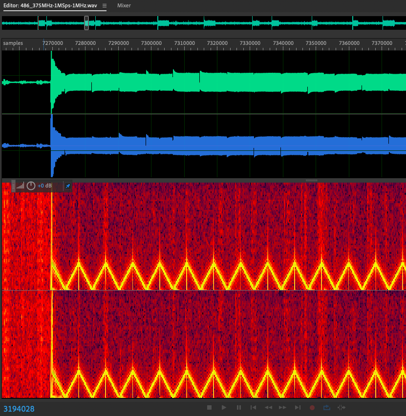
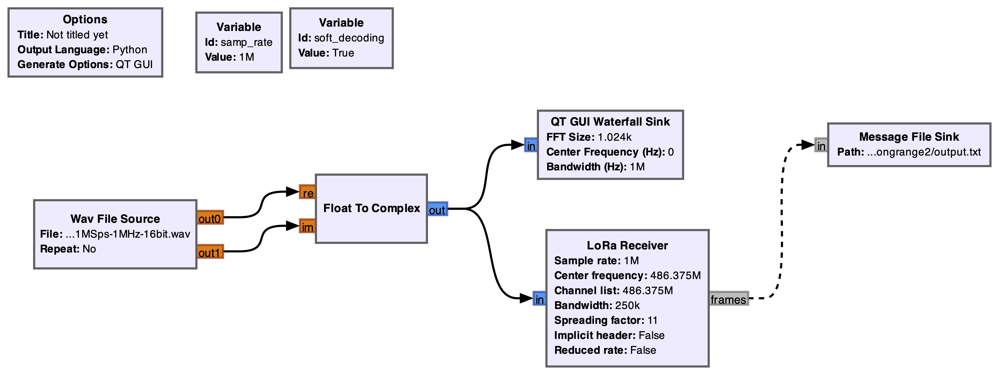

## Long Range 2 - Misc Problem - Writeup by Robert Xiao (@nneonneo)

We're given a zip file that contains two files: `486_375MHz-1MSps-1MHz.wav` and `flash_dump`.

## Extracting the Signal

The provided .wav file is a 24-bit, 2-channel .wav file with a sample rate of 1 MHz. The filename suggests that it was captured from a radio tuned to 486.375MHz as the center frequency.

From last year's Real World CTF Long Range challenge, we suspect that this file contains a captured LoRA transmission. Opening it in Audition confirms this, with the characteristic Chirp Spread Spectrum sweeps visible in the spectrogram view:



Note that the two channels here refer to the real and imaginary components of the signal. As such, the "sawtooth" pattern is illusory: in reality, these are smooth sweeps from -125 kHz up to +125 kHz, but the "negative" frequencies appear as positive frequencies in this spectrogram plot.

We can easily determine the bandwidth (250 kHz) from the plot. Each sweep is approximately 8.2 ms long, which corresponds to a spreading factor of 11 (2^11 / 250 kHz = 8.192 ms).

With these settings, we can use GNU Radio with the [gr-lora](https://github.com/rpp0/gr-lora) receiver to decode the signal. Note that we need to save the .wav in 16-bit format for GNU Radio to read it.



The resulting packets are:

```
2d 31 e0 bc 4b 6c fa c4 c0 6d fa 66 26 d2 02 0b 08 a7 92 b3 78 fb 63 77 d7 e0 54 d7 4f 67 1e c0 2d f1 8c 7d 04 66 c9 31 bb 22 40 0f c9 ec 25 c8 71 33
1b 31 e0 c4 c0 6d fa bc 4b 6c fa 29 5d 91 38 03 08 a7 92 12 19 7e 5e 99 47 1a 63 33 0f d5 24 55
49 31 20 c4 c0 6d fa bc 4b 6c fa a6 41 be 1e 0b 08 a7 92 b9 4d 99 11 17 1c a9 be 15 47 44 0f f1 d6 ce 46 02 e2 d2 a4 11 af e6 da e9 f2 0c db d0 5e e5 04 3b 82 cd 6c 79 47 31 94 f9 79 73 d9 0c 85 b3 09 8c c7 22 73 85 64 36 c8 be 0a de
1b 31 e0 bc 4b 6c fa c4 c0 6d fa 0f 21 39 44 03 08 a7 92 b8 56 c7 f0 c5 8e 43 63 70 27 c9 75 2d
5f 30 00 ff ff ff ff c4 c0 6d fa a3 f3 0f 12 03 08 a7 92 aa c1 8d 79 d8 3c 56 bc 10 34 5a ea 0f cc 82 91 41 29 1c 63 01 cc 6e 23 15 f6 a1 0f 72 20 b9 5d f1 88 c5 e5 0b ec ec 89 cb 54 b5 40 6e c1 83 c1 b7 bf 77 5e 6b ff 15 0d aa 09 c8 3d 6c 98 4f 70 c9 e2 dc 26 97 2f 84 e0 5c ba e7 5a 89 51 d4 cd 2f
5f 30 00 ff ff ff ff c4 c0 6d fa a3 f3 0f 12 02 08 a7 92 aa c1 8d 79 d8 3c 56 bc 10 34 5a ea 0f cc 82 91 41 29 1c 63 01 cc 6e 23 15 f6 a1 0f 72 20 b9 5d f1 88 c5 e5 0b ec ec 89 cb 54 b5 40 6e c1 83 c1 b7 bf 77 5e 6b ff 15 0d aa 09 c8 3d 6c 98 4f 70 c9 e2 dc 26 97 2f 84 e0 5c ba e7 5a 89 51 d4 d7 b3
2d 31 e0 ff ff ff ff bc 4b 6c fa ed bb 63 1c 03 08 a7 92 c9 4d 34 c5 67 d1 39 89 47 9d 37 6c 8a 0c ac dc 65 8d 12 56 4a 93 ef 74 00 25 44 37 ac 10 56
2d 31 e0 ff ff ff ff bc 4b 6c fa ed bb 63 1c 02 08 a7 92 c9 4d 34 c5 67 d1 39 89 47 9d 37 6c 8a 0c ac dc 65 8d 12 56 4a 93 ef 74 00 25 44 37 ac 39 d8
1f 31 40 ff ff ff ff bc 4b 6c fa a6 20 df 2d 03 04 a7 92 5a fa cd 43 97 76 00 36 1b 8c c3 f5 0f bd 5d 65 2e
1f 31 40 ff ff ff ff bc 4b 6c fa a6 20 df 2d 02 04 a7 92 5a fa cd 43 97 76 00 36 1b 8c c3 f5 0f bd 5d 87 3e
68 30 60 ff ff ff ff c4 c0 6d fa 88 99 c2 02 03 04 a7 92 50 01 50 2e 35 d7 3a b7 93 c3 e9 ad 6a cc 9d a6 a4 95 5b c5 6b 80 54 e9 98 9d 76 f5 35 5c f2 86 8b 90 bf fa e3 21 d5 10 77 be 4e 17 74 fc 07 4f 63 a4 c0 af 6b a3 8f 33 a8 29 b0 78 4b da db cc 73 8b 16 e9 30 e7 41 c4 8f 4d 6c 0c ab 01 2e 56 05 12 2d ce 40 ea eb 7b 76 26
68 30 60 ff ff ff ff c4 c0 6d fa 88 99 c2 02 02 04 a7 92 50 01 50 2e 35 d7 3a b7 93 c3 e9 ad 6a cc 9d a6 a4 95 5b c5 6b 80 54 e9 98 9d 76 f5 35 5c f2 86 8b 90 bf fa e3 21 d5 10 77 be 4e 17 74 fc 07 4f 63 a4 c0 af 6b a3 8f 33 a8 29 b0 78 4b da db cc 73 8b 16 e9 30 e7 41 c4 8f 4d 6c 0c ab 01 2e 56 05 12 2d ce 40 ea eb 7b e2 d3
22 31 70 ff ff ff ff c4 c0 6d fa 5f 8a 54 22 03 04 a7 92 53 1f 89 a3 6f ea 30 18 c9 ce b7 e7 1f a3 cd 72 71 ed 14 0f
22 31 70 ff ff ff ff c4 c0 6d fa 5f 8a 54 22 02 04 a7 92 53 1f 89 a3 6f ea 30 18 c9 ce b7 e7 1f a3 cd 72 71 ed a7 3a
```

The 3-byte LoRA PHDR header and 2-byte CRC footer are included in each packet.

## Decrypting the Messages

The messages are clearly encrypted: they start with a cleartext header which apparently includes two four-byte "address" fields (little-endian values 0xffffffff, 0xfa6c4bbc, 0xfa6dc0c4), and about 8 plaintext bytes (e.g. 66 26 d2 02 0b 08 a7 92) before a block of encrypted data.

`strings` on the flash dump reveals references to [Meshtastic](meshtastic.org), a mesh network firmware for low-power devices. Strings suggest that the version is 2.2.14.57542ce, and indeed, in [that version](https://github.com/meshtastic/firmware/releases/download/v2.2.14.57542ce/firmware-2.2.14.57542ce.zip) of the firmware we find an almost perfect match to the flash dump in firmware-tbeam-s3-core-2.2.14.57542ce.bin (at offset 0) and littlefs-2.2.14.57542ce.bin (at offset 0x300000). There are only a few small differences in the blocks at 0x9000, 0x300000 and 0x3ef000.

The differences at 0x9000 turn out to mostly be about radio calibration. The differences in 0x300000 and 0x3ef000 belong to the littlefs filesystem stored on the Flash. Using the online littlefs disk viewer at [https://tniessen.github.io/littlefs-disk-img-viewer/](https://tniessen.github.io/littlefs-disk-img-viewer/), we can dump out the contents of the `prefs` directory (which only exists in our flash dump, not in the original firmware).

This directory contains three files: channels.proto, config.proto, and db.proto. By searching the Meshtastic sources for these filenames, we can find the code in [NodeDB.cpp](https://github.com/meshtastic/firmware/blob/v2.2.14.57542ce/src/mesh/NodeDB.cpp) that loads these files: they're encoded using protobuf definitions from [meshtastic/protobufs](https://github.com/meshtastic/protobufs). After compiling these protobufs with `protoc --python_out=...`, a quick script dumps out these files:

```python
import sys
sys.path.append("protobufs/python")

from meshtastic.deviceonly_pb2 import DeviceState, ChannelFile
from meshtastic.localonly_pb2 import LocalConfig

db = DeviceState()
db.ParseFromString(open("db.proto", "rb").read())
print("== db ==")
print(db)
print()

channels = ChannelFile()
channels.ParseFromString(open("channels.proto", "rb").read())
print("== channels ==")
print(channels)
print()

config = LocalConfig()
config.ParseFromString(open("config.proto", "rb").read())
print("== config == ")
print(config)
````

Under channels, we find an intriguing entry:

```
channels {
  index: 1
  settings {
    psk: "\316\370\333\216\216`\027\375m\314\242\035\270\241GmE\024\200\254\327\364\371\367i\247c\365(\300\021\367"
    name: "Buddies"
    id: 1
  }
  role: SECONDARY
}
```

### Meshtastic Packets

The code that sends a Meshtastic packet can be found in [RadioInterface.cpp](https://github.com/meshtastic/firmware/blob/v2.2.14.57542ce/src/mesh/RadioInterface.cpp#L523). We see that the packet format is defined by the PacketHeader structure, which has two 32-bit `to` and `from` node numbers, a 32-bit `id`, and 8-bit `flags` and `channel`. Additionally, because of struct alignment, there are two padding bytes in the structure (the `a7 92` bytes in our captured packets).

Encryption is implemented in [Channels.cpp](https://github.com/meshtastic/firmware/blob/v2.2.14.57542ce/src/mesh/Channels.cpp), which calls into the CryptoEngine interface. There is a hardcoded key for the default channel. `CryptoEngine` has several implementations, such as [ESP32CryptoEngine.cpp](https://github.com/meshtastic/firmware/blob/v2.2.14.57542ce/src/platform/esp32/ESP32CryptoEngine.cpp), but they all implement AES-CTR mode with a custom nonce.

The nonce value is calculated in [CryptoEngine::initNonce](https://github.com/meshtastic/firmware/blob/v2.2.14.57542ce/src/mesh/CryptoEngine.cpp), and consists of the 32-bit packet ID zero-extended to 64 bits concatenated with the 32-bit sender node ID. Note that this is not secure! By the birthday paradox, only around 2^16 messages would need to be sent by a single user to have a good chance of two messages having the same nonce - which breaks the security of AES-CTR.

Thus, we can write a decryption script to decrypt messages using the appropriate key (default or "Buddies" channel key):

```python
# Packets decoded using rpp0/gr-lora using 1M sample rate, 250k bandwidth, 11 sampling factor, no implicit header
packets = """
2d 31 e0 bc 4b 6c fa c4 c0 6d fa 66 26 d2 02 0b 08 a7 92 b3 78 fb 63 77 d7 e0 54 d7 4f 67 1e c0 2d f1 8c 7d 04 66 c9 31 bb 22 40 0f c9 ec 25 c8 71 33 (Klmf&xcwTOg-}f1"@%q3)
1b 31 e0 c4 c0 6d fa bc 4b 6c fa 29 5d 91 38 03 08 a7 92 12 19 7e 5e 99 47 1a 63 33 0f d5 24 55 (mKl)]8~^Gc3$U)
49 31 20 c4 c0 6d fa bc 4b 6c fa a6 41 be 1e 0b 08 a7 92 b9 4d 99 11 17 1c a9 be 15 47 44 0f f1 d6 ce 46 02 e2 d2 a4 11 af e6 da e9 f2 0c db d0 5e e5 04 3b 82 cd 6c 79 47 31 94 f9 79 73 d9 0c 85 b3 09 8c c7 22 73 85 64 36 c8 be 0a de (mKlAMGDF^;lyG1ys"sd6)
1b 31 e0 bc 4b 6c fa c4 c0 6d fa 0f 21 39 44 03 08 a7 92 b8 56 c7 f0 c5 8e 43 63 70 27 c9 75 2d (Klm!9DVCcp'u-)
5f 30 00 ff ff ff ff c4 c0 6d fa a3 f3 0f 12 03 08 a7 92 aa c1 8d 79 d8 3c 56 bc 10 34 5a ea 0f cc 82 91 41 29 1c 63 01 cc 6e 23 15 f6 a1 0f 72 20 b9 5d f1 88 c5 e5 0b ec ec 89 cb 54 b5 40 6e c1 83 c1 b7 bf 77 5e 6b ff 15 0d aa 09 c8 3d 6c 98 4f 70 c9 e2 dc 26 97 2f 84 e0 5c ba e7 5a 89 51 d4 cd 2f (my<V4ZA)cn#r ]T@nw^k=lOp&/\ZQ/)
5f 30 00 ff ff ff ff c4 c0 6d fa a3 f3 0f 12 02 08 a7 92 aa c1 8d 79 d8 3c 56 bc 10 34 5a ea 0f cc 82 91 41 29 1c 63 01 cc 6e 23 15 f6 a1 0f 72 20 b9 5d f1 88 c5 e5 0b ec ec 89 cb 54 b5 40 6e c1 83 c1 b7 bf 77 5e 6b ff 15 0d aa 09 c8 3d 6c 98 4f 70 c9 e2 dc 26 97 2f 84 e0 5c ba e7 5a 89 51 d4 d7 b3 (my<V4ZA)cn#r ]T@nw^k=lOp&/\ZQ)
2d 31 e0 ff ff ff ff bc 4b 6c fa ed bb 63 1c 03 08 a7 92 c9 4d 34 c5 67 d1 39 89 47 9d 37 6c 8a 0c ac dc 65 8d 12 56 4a 93 ef 74 00 25 44 37 ac 10 56 (KlcM4g9G7leVJt%D7V)
2d 31 e0 ff ff ff ff bc 4b 6c fa ed bb 63 1c 02 08 a7 92 c9 4d 34 c5 67 d1 39 89 47 9d 37 6c 8a 0c ac dc 65 8d 12 56 4a 93 ef 74 00 25 44 37 ac 39 d8 (KlcM4g9G7leVJt%D79)
1f 31 40 ff ff ff ff bc 4b 6c fa a6 20 df 2d 03 04 a7 92 5a fa cd 43 97 76 00 36 1b 8c c3 f5 0f bd 5d 65 2e (Kl -ZCv6]e.)
1f 31 40 ff ff ff ff bc 4b 6c fa a6 20 df 2d 02 04 a7 92 5a fa cd 43 97 76 00 36 1b 8c c3 f5 0f bd 5d 87 3e (Kl -ZCv6]>)
68 30 60 ff ff ff ff c4 c0 6d fa 88 99 c2 02 03 04 a7 92 50 01 50 2e 35 d7 3a b7 93 c3 e9 ad 6a cc 9d a6 a4 95 5b c5 6b 80 54 e9 98 9d 76 f5 35 5c f2 86 8b 90 bf fa e3 21 d5 10 77 be 4e 17 74 fc 07 4f 63 a4 c0 af 6b a3 8f 33 a8 29 b0 78 4b da db cc 73 8b 16 e9 30 e7 41 c4 8f 4d 6c 0c ab 01 2e 56 05 12 2d ce 40 ea eb 7b 76 26 (mPP.5:j[kTv5\!wNtOck3)xKs0AMl.V-@{v&)
68 30 60 ff ff ff ff c4 c0 6d fa 88 99 c2 02 02 04 a7 92 50 01 50 2e 35 d7 3a b7 93 c3 e9 ad 6a cc 9d a6 a4 95 5b c5 6b 80 54 e9 98 9d 76 f5 35 5c f2 86 8b 90 bf fa e3 21 d5 10 77 be 4e 17 74 fc 07 4f 63 a4 c0 af 6b a3 8f 33 a8 29 b0 78 4b da db cc 73 8b 16 e9 30 e7 41 c4 8f 4d 6c 0c ab 01 2e 56 05 12 2d ce 40 ea eb 7b e2 d3 (mPP.5:j[kTv5\!wNtOck3)xKs0AMl.V-@{)
22 31 70 ff ff ff ff c4 c0 6d fa 5f 8a 54 22 03 04 a7 92 53 1f 89 a3 6f ea 30 18 c9 ce b7 e7 1f a3 cd 72 71 ed 14 0f (m_T"So0rq)
22 31 70 ff ff ff ff c4 c0 6d fa 5f 8a 54 22 02 04 a7 92 53 1f 89 a3 6f ea 30 18 c9 ce b7 e7 1f a3 cd 72 71 ed a7 3a (m_T"So0rq:)
""".strip("\n")

# incorrectly decoded packets at the end
"""
09 11 40 09 11 40 ff c4 c0 6d fa 5f 8a 54 (@m_T)
09 11 40 ff c4 c0 6d fa 5f 8a 54 (@m_T)
"""

import struct
from Crypto.Cipher import AES

# ESP32 default key
key1 = bytes([0xd4, 0xf1, 0xbb, 0x3a, 0x20, 0x29, 0x07, 0x59,
                                     0xf0, 0xbc, 0xff, 0xab, 0xcf, 0x4e, 0x69, 0x01])
# PSK extracted from prefs/channels.proto in the flash dump's littlefs
# https://tniessen.github.io/littlefs-disk-img-viewer/ with blocksize=4096 and littlefs dumped from +0x300000 in the flash_dump
# protobufs from https://github.com/meshtastic/protobufs and loading logic from https://github.com/meshtastic/firmware/blob/master/src/mesh/NodeDB.cpp
key2 = bytes.fromhex("cef8db8e8e6017fd6dcca21db8a1476d451480acd7f4f9f769a763f528c011f7")

for row in packets.split("\n"):
    h = row.split("(", 1)[0]
    data = bytes.fromhex(h)

    # read PacketHeader (logic from src/mesh/RadioInterface.cpp - RadioInterface::beginSending)
    size, lora_flags, dst, src, packet_id, flags, channel = struct.unpack("<BHIIIBB", data[:17])
    hop_limit = flags & 7
    other_flags = flags & 0xf8 # e.g. PACKET_FLAGS_WANT_ACK_MASK = 8
    padding = data[17:19] # PacketHeader struct is padded to 16 bytes
    payload = data[19:-2] # last two bytes are LoRA CRC?
    #print(f"lora_flags={hex(lora_flags)}, {hex(src)} -> {hex(dst)}, packet_id={hex(packet_id)}, flags=(hop_limit={hop_limit}, other_flags={hex(other_flags)}), channel={hex(channel)} padding={padding.hex()}")
    assert size + 5 == len(data)

    nonce = struct.pack("<QI", packet_id, src)
    if channel == 0x8:
        msg = AES.new(key1, mode=AES.MODE_CTR, nonce=nonce).decrypt(payload)
    else:
        msg = AES.new(key2, mode=AES.MODE_CTR, nonce=nonce).decrypt(payload)

    # msg is a Data protobuf
    print(channel, hex(src), msg)
```

After running this, we can see the whole conversation, and inside, our flag: `rwctf{No_h0p_th1s_tim3_c831bcad725935ba25c0a3708e49c0c8}`
