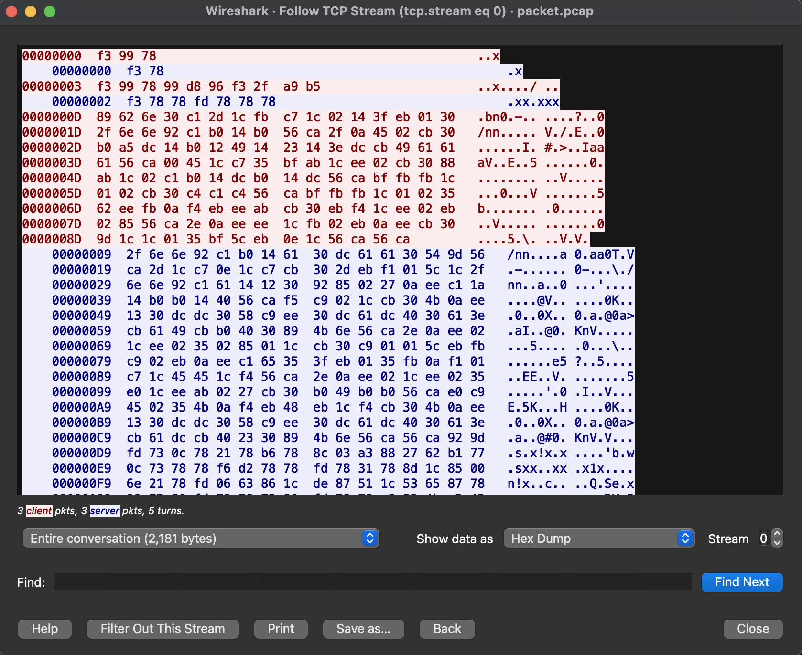

# The Truth of Plain&emsp;Misc/Crypto, 87 points

_Writeup by [@bluepichu](https://github.com/bluepichu)_

> You are right, but "CTF" originated from the DEFCON global hacker conference in 1996. It is a competitive game among network security enthusiasts. This game takes place in a competition called "RealWorld", where those who solve the challenge will be awarded a "Flag". You will play a character named "CTFer" and work with your teammates in the game, using knowledge and skills to solve various challenges - and at the same time, gradually discover the truth of "Plain".
>
> Repository: https://github.com/gwuhaolin/lightsocks

The handout for the problems consists of a PCAP with only a couple of TCP connections and an encrypted zip file.  Presumably, the goal is to decrypt the zip file.

The Lightsocks application referenced in the description is a Shadowsocks alternative that performs some light obfuscation of SOCKS5 traffic.  The [cipher](https://github.com/gwuhaolin/lightsocks/blob/63d90182a1daac34e3a8eae86b342776be7e025b/cipher.go) used by the application is a simple substution cipher derived from the password used when initializing the application, [which is simply a base64-encoded permutation of all possible byte values](https://github.com/gwuhaolin/lightsocks/blob/63d90182a1daac34e3a8eae86b342776be7e025b/password.go#L39).

Our initial approach was to try and use the fact that [the password that the application generates is seeded with the current unix timestamp with only second-level resolution](https://github.com/gwuhaolin/lightsocks/blob/63d90182a1daac34e3a8eae86b342776be7e025b/password.go#L17), meaning that we could potentially brute-force the seed used to generate it given a known starting point and some known plaintext.  Since we knew that the traffic is just a SOCKS5 connection under the hood, we were able to deduce some byte values from the handshake.  For example, here is a hexdump of the beginning of the first conversation in the PCAP:

	

The first message in a SOCKS5 connection is a client greeting, consisting of a version number, a number of supported authentication methods, and then one byte per authentication method.  From this we can deduce that the first two bytes are `05 01`, since the version number is 5 and it's followed by only one authentication type.  Similarly, we can infer that the client's second message is a connection request, of which the third byte is a reserved field always set to `00`.  With this information we can deduce that the cipher maps `05` to `f3`, `01` to `99`, and `00` to `78`, allowing us to check any guess we might have for the seed used to generate the password.

Unfortunately, this approach didn't pan out; we searched backwards from the timestamp on the first packed of the PCAP through several years of possible seeds and were unable to locate the initial password.

We then decided to try to inspect the data more directly.  Realizing that the content being sent over the connection was probably an HTTP request, we were able to identify more bytes.  We started by looking for a pair of bytes that would be the two `T` characters in `HTTP`, and found them in the third packet as `2f 6e 6e 92`.  This was consistent with the information earlier in the packet as the third element was `6e`, which is consistent with the HTTP method in question being `GET`.

Manually decoding the information in the header, we were eventually able to find that the first conversation downloaded a file called `Secret.zip`, and the second downloaded a file called `key`.  `Secret.zip` is the same name as the encrypted zip file in the handout, but `key` was new information.  We continued by making inferences by hand about the content of the HTTP headers (and eventually the content of `key` since it was plaintext), and were able to recover the entirety of `key`.  We also verified this result by recovering the entire substitution cipher from the body of the `Secret.zip` request.

We got stuck here for a bit because the `key` file contained a password that was incorrect for `Secret.zip`.  Eventually, we realized that `key` is one of the files within `Secret.zip`, and that the file was encrypted with ZipCrypto.  This is vulnerable to a known plaintext attack, so using [bkcrack](https://github.com/kimci86/bkcrack) we were able to recover the contents, specifically the known `key` file and another encrypted zip, `Document.zip`.  The password contained in `key` was the password to this encrypted zip, finally giving us the flag.