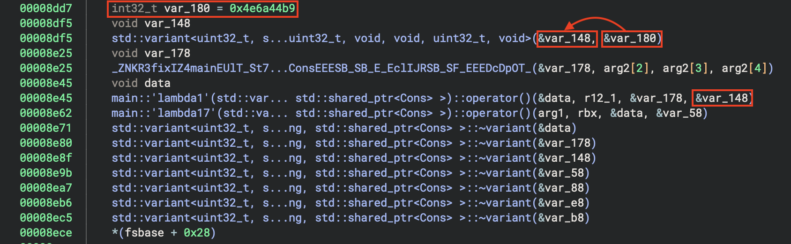
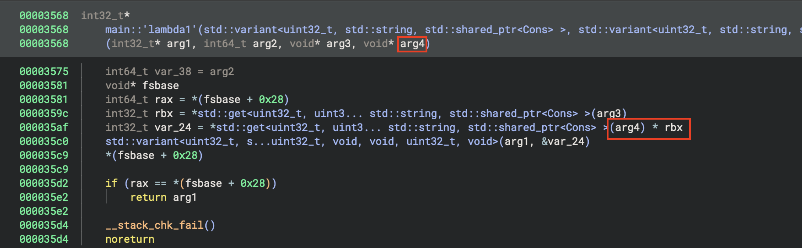
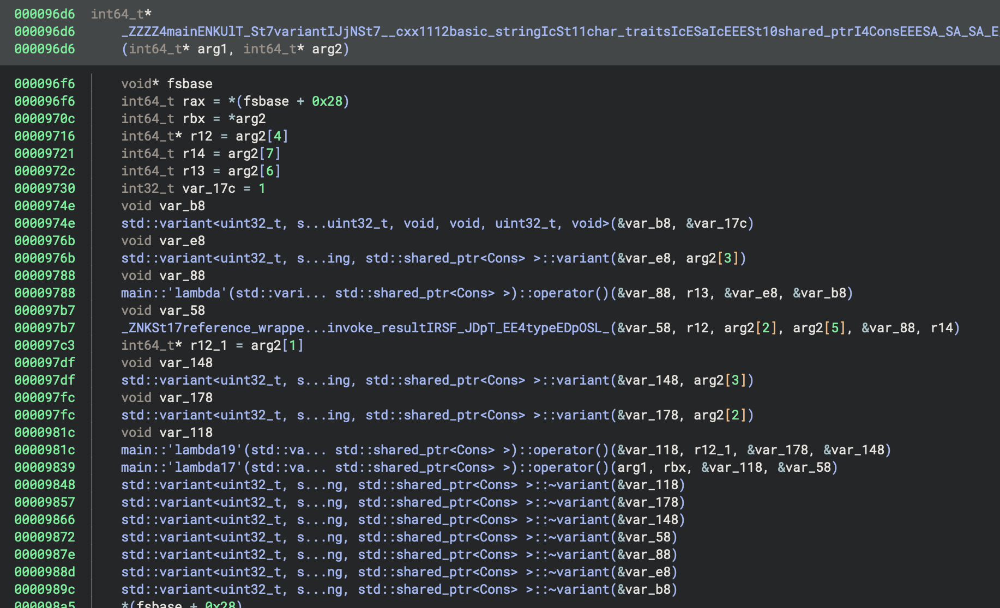
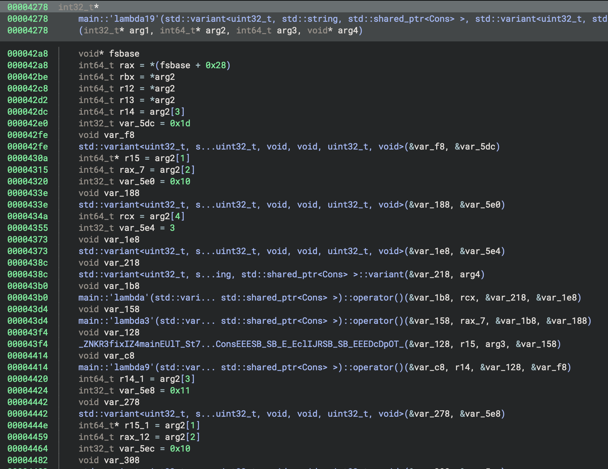
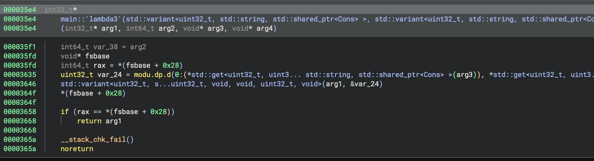
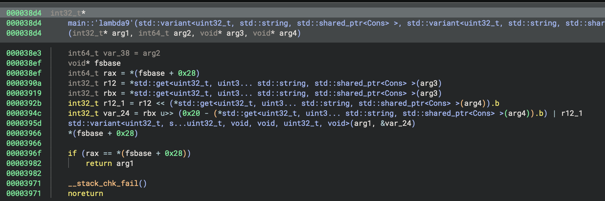
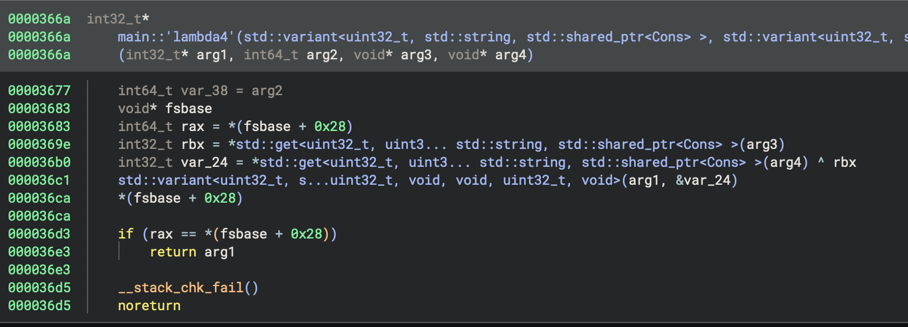

rev / fisforflag
===

Writeup by: ath0

Category: rev

I solved this problem with the help of my debugging/reversing tool, [Pyda](https://github.com/ndrewh/pyda).
This writeup serves as both a writeup of the challenge, and a showcase of the capabilities of Pyda (which I will eventually post to my blog https://fastb.in).

## Getting started

First up is getting the challenge running. You can use a `ubuntu:24.04` Docker container to run the challenge,
but since we want to run under Pyda I opted to copy the libraries from there into the `pyda` image:

```dockerfile
FROM ubuntu:24.04 as target

FROM ghcr.io/ndrewh/pyda

COPY --from=target /usr/lib/x86_64-linux-gnu/ /target_libs/

RUN apt install -y patchelf

COPY F /F
RUN patchelf --set-interpreter /target_libs/ld-linux-x86-64.so.2 --set-rpath /target_libs/ /F
RUN apt install -y binutils
```

We can run the challenge and we see it's a flagchecker.

```bash
root@6792c69f4f0d:/opt/pyda# /F
FLAG:
```

OK -- time to play a game i like to call "how far can we get without opening binja":

First, we use the [compare-logging example](https://github.com/ndrewh/pyda/blob/32e11562ee2fc93f3f5cec822a7b6161b2f8052e/examples/cmplog.py) Pyda script
to print out the operands to all of the comparison instructions in the program:

```bash
root@6792c69f4f0d:/opt/pyda# pyda examples/cmplog.py -- /F
cmp_locs: 46
FLAG: AAAAAAAAAA
cmp @ 0x15787 rdx=0x100000003 rax=0x100000001 False
[...]
cmp @ 0x15787 rdx=0x100000002 rax=0x100000001 False
cmp @ 0x18276 rbx=0x0 rax=0x0 True
cmp @ 0x182a7 rcx=0xa rdx=0x40 False
"Wrong"
```

We see the final comparison before "Wrong" is printed is between 0xa (the number of `A`s we entered) and 0x40.
This tells us that the flag is probably 64 bytes long.

Once we use the correct flag length, there is a larger number of comparisons, which ultimately ends in this
suspicious comparison:
```
cmp @ 0x1891b rcx=0xc3df45f3 rdx=0x11793013 False
```

Changing the input changes the value in `rcx`, but not `rdx` -- which suggests that the goal
is to make these values match at the end of the flag transformation.

We can use Pyda's backtrace feature to print out a (demangled!) backtrace at this comparison:
```python
p = process(io=True)

e = ELF(p.exe_path)
e.address = p.maps[p.exe_path].base

p.hook(e.address + 0x1891b, lambda p: print(p.backtrace_cpp(short=True)))

# Run the process until FLAG: is received
p.recvuntil("FLAG: ")
p.sendline(("ABCDEFGH").ljust(0x40, "A")) # ABCDEFGHAAAAAAAAAAAAAAAAAAAAAA.....A

# Run the process until termination
p.run()
```

In this script, we passed `io=True` to the Pyda `process()` call and used the pwntools-style `p.recvuntil` and `p.sendline`
interface to send our input directly.

```
root@6792c69f4f0d:/opt/pyda# pyda script.py -- /F
[F+0x1891b] auto std::operator!=<unsigned int, std::__cxx11::b...onst&, std::integral_constant<unsigned long, 0ul>)
[F+0x1b9c8] void std::__invoke_impl<void, std::operator!=<unsi...st&, std::integral_constant<unsigned long, 0ul>&&)
[F+0x1a6ac] std::__invoke_result<std::operator!=<unsigned int,...st&, std::integral_constant<unsigned long, 0ul>&&)
[F+0x189b5] std::__detail::__variant::__gen_vtable_impl<std::_...allocator<char> >, std::shared_ptr<Cons> > const&)
[F+0x18dd3] decltype(auto) std::__do_visit<std::__detail::__va...allocator<char> >, std::shared_ptr<Cons> > const&)
[F+0x18ea2] void std::__detail::__variant::__raw_idx_visit<std...allocator<char> >, std::shared_ptr<Cons> > const&)
[F+0x16755] bool std::operator!=<unsigned int, std::__cxx11::b...allocator<char> >, std::shared_ptr<Cons> > const&)
[F+0x3b0c] main::{lambda(std::variant<unsigned int, std::__cx...:allocator<char> >, std::shared_ptr<Cons> >) const
[F+0xc9cb] main::{lambda(auto:1, std::variant<unsigned int, s...r<Cons> >) const::{lambda()#2}::operator()() const
[F+0x14617] std::variant<unsigned int, std::__cxx11::basic_str... >, std::shared_ptr<Cons> >) const::{lambda()#2}&)
[F+0x13208] std::enable_if<is_invocable_r_v<std::variant<unsig... >, std::shared_ptr<Cons> >) const::{lambda()#2}&)
[F+0x105fa] std::_Function_handler<std::variant<unsigned int, ...t::{lambda()#2}>::_M_invoke(std::_Any_data const&)
[F+0x167d4] std::function<std::variant<unsigned int, std::__cx...>, std::shared_ptr<Cons> > ()>::operator()() const
[F+0x3ba6] main::{lambda(std::variant<unsigned int, std::__cx...ocator<char> >, std::shared_ptr<Cons> > ()>) const
[F+0xcc75] std::variant<unsigned int, std::__cxx11::basic_str...:allocator<char> >, std::shared_ptr<Cons> >) const
[F+0x53fe] decltype(auto) fix<main::{lambda(auto:1, std::vari...locator<char> >, std::shared_ptr<Cons> >&) const &
[F+0x5539] main::{lambda()#1}::operator()() const
[F+0x13347] std::variant<unsigned int, std::__cxx11::basic_str...a()#1}&>(std::__invoke_other, main::{lambda()#1}&)
[F+0x10753] std::enable_if<is_invocable_r_v<std::variant<unsig...Cons> >, main::{lambda()#1}&>(main::{lambda()#1}&)
[F+0xe3d3] std::_Function_handler<std::variant<unsigned int, ...n::{lambda()#1}>::_M_invoke(std::_Any_data const&)
[F+0x167d4] std::function<std::variant<unsigned int, std::__cx...>, std::shared_ptr<Cons> > ()>::operator()() const
[F+0x3b91] main::{lambda(std::variant<unsigned int, std::__cx...ocator<char> >, std::shared_ptr<Cons> > ()>) const
[F+0x67b4] main
[libc.so.6+0x2a1ca] __libc_init_first
[libc.so.6+0x2a28b] __libc_start_main
[F+0x3325] _start
```

The backtrace (even the full version) is pretty awful and seems to be filled with a bunch of anonymous lambdas. It's looking like we might actually have to open binja :(.
`shared_ptr<Cons>` stood out to me though, so the first thing we'll do is print out the arguments on every call to that constructor.

### Printing out the lists + the 1st transformation

We can add this short bit of code to our Pyda script to print out the lists as they are constructed:

```
def cons(p):
    print(f"cons {hex(u32(p.read(p.regs.rsi, 4)))}")

p.hook(e.address + 0x15a06, cons)
```

First, it prints a bunch of constants (ending with the constant we saw in the comparison earlier).
```
cons 0xb7e9a2a4
cons 0x1904c652
cons 0xbe8afe4d
cons 0xbd18775a
cons 0x82841cf4
cons 0xd2c1d5af
cons 0xf389c4a
cons 0x451f151a
cons 0xd5689a8c
cons 0x927b5bd9
cons 0xf86c82d7
cons 0x34bc7c60
cons 0x97aef869
cons 0x2c0cccdd
cons 0x88d2ec9b
cons 0x11793013
```

And then a bunch more (smaller) constants

```
cons 0x7
cons 0x0
cons 0xc
cons 0xd
cons 0x2
cons 0xf
cons 0xb
cons 0x8
cons 0x6
cons 0x5
cons 0x9
cons 0x4
cons 0xa
cons 0x1
cons 0xe
cons 0x3
```

Followed by what is clearly our input (in reverse order and grouped into 4-byte chunks)
```
cons 0x41414141
cons 0x41414141
cons 0x41414141
cons 0x41414141
cons 0x41414141
cons 0x41414141
cons 0x41414141
cons 0x41414141
cons 0x41414141
cons 0x41414141
cons 0x41414141
cons 0x41414141
cons 0x41414141
cons 0x41414141
cons 0x48474645
cons 0x44434241
```

and the result of *some* transformation!

```
cons 0x4e4e4e4e
cons 0x4e4e4e4e
cons 0x4e4e4e4e
cons 0x4e4e4e4e
cons 0x4e4e4e4e
cons 0x4e4e4e4e
cons 0x4e4e4e4e
cons 0x4e4e4e4e
cons 0x4e4e4e4e
cons 0x4e4e4e4e
cons 0x4e4e4e4e
cons 0x4e4e4e4e
cons 0x4e4e4e4e
cons 0x4e4e4e4e
cons 0x48464549
cons 0x444a414e
```

I figured this transformation out relatively quickly with just some guesswork:

```python
# Take the numbers from the first list (in reverse)
>>> m = [7, 0, 12, 13, 2, 15, 11, 8, 6, 5, 9, 4, 10, 1, 14, 3][::-1]

# Now map 0x41 => 0x4e, one nibble at a time
>>> hex(m[0x4])
'0x4'
>>> hex(m[0x1])
'0xe'
```

### 2nd transformation
```
cons 0x93af4e5e
cons 0x93af4e5e
cons 0x93af4e5e
cons 0x93af4e5e
cons 0x93af4e5e
cons 0x93af4e5e
cons 0x93af4e5e
cons 0x93af4e5e
cons 0x93af4e5e
cons 0x93af4e5e
cons 0x93af4e5e
cons 0x93af4e5e
cons 0x93af4e5e
cons 0x93af4e5e
cons 0xd36975c1
cons 0xe14de95e
```


The next transformation (e.g. from 0x4e4e4e4e => 0x93af4e5e) was somewhat more perplexing. I checked if it could be a constant XOR,
but that didn't work. It seems like we might actually have to open binja (we have to use a rev tool to solve a rev challenge???).

I looked through the backtraces for the first two transformations (filtering for only functions in the `main::` namespace).

For the first transformation:
```
cons 4e4e4e4e
[F+0x3bfe] main::{lambda(std::variant<unsigned int, std::__cx...:allocator<char> >, std::shared_ptr<Cons> >) const
[F+0x8741] main::{lambda(auto:1, std::variant<unsigned int, s...r<Cons> >) const::{lambda()#2}::operator()() const
[F+0x3ba6] main::{lambda(std::variant<unsigned int, std::__cx...ocator<char> >, std::shared_ptr<Cons> > ()>) const
[F+0x86d0] main::{lambda(auto:1, std::variant<unsigned int, s...r<Cons> >) const::{lambda()#2}::operator()() const
[F+0x3ba6] main::{lambda(std::variant<unsigned int, std::__cx...ocator<char> >, std::shared_ptr<Cons> > ()>) const
[...]
``````

For the second transformation:
```
cons 5e4eaf93
[F+0x3bfe] main::{lambda(std::variant<unsigned int, std::__cx...:allocator<char> >, std::shared_ptr<Cons> >) const
[F+0x8e67] main::{lambda(auto:1, std::variant<unsigned int, s...r<Cons> >) const::{lambda()#2}::operator()() const
[F+0x3ba6] main::{lambda(std::variant<unsigned int, std::__cx...ocator<char> >, std::shared_ptr<Cons> > ()>) const
[F+0x8dcc] main::{lambda(auto:1, std::variant<unsigned int, s...r<Cons> >) const::{lambda()#2}::operator()() const
[F+0x3ba6] main::{lambda(std::variant<unsigned int, std::__cx...ocator<char> >, std::shared_ptr<Cons> > ()>) const
[...]
```

It seems that `F+0x3bfe` is an aperation common to both transformations; looking at the caller `F+0x8e67`
in the second transformation we find a function with a suspicious-looking constant:





So the transformation here is not XOR, it's multiplication (mod 2^32)!
```python
>>> hex((0x4e4e4e4e * 0x4e6a44b9) & 0xffffffff)
'0x93af4e5e'
```

### 3rd transformation

The backtrace for the next transformation is also different:
```
[F+0x3bfe] main::{lambda(std::variant<unsigned int, std::__cx...:allocator<char> >, std::shared_ptr<Cons> >) const
[F+0x983e] main::{lambda(auto:1, std::variant<unsigned int, s...erator()() const::{lambda()#2}::operator()() const
[F+0x3ba6] main::{lambda(std::variant<unsigned int, std::__cx...ocator<char> >, std::shared_ptr<Cons> > ()>) const
[F+0x9f2e] main::{lambda(auto:1, std::variant<unsigned int, s...r<Cons> >) const::{lambda()#2}::operator()() const
[F+0x3ba6] main::{lambda(std::variant<unsigned int, std::__cx...ocator<char> >, std::shared_ptr<Cons> > ()>) const
[F+0x97bc] main::{lambda(auto:1, std::variant<unsigned int, s...erator()() const::{lambda()#2}::operator()() const
[F+0x3ba6] main::{lambda(std::variant<unsigned int, std::__cx...ocator<char> >, std::shared_ptr<Cons> > ()>) const
[F+0x9f2e] main::{lambda(auto:1, std::variant<unsigned int, s...r<Cons> >) const::{lambda()#2}::operator()() const
[F+0x3ba6] main::{lambda(std::variant<unsigned int, std::__cx...ocator<char> >, std::shared_ptr<Cons> > ()>) const
[F+0x97bc] main::{lambda(auto:1, std::variant<unsigned int, s...erator()() const::{lambda()#2}::operator()() const
[F+0x3ba6] main::{lambda(std::variant<unsigned int, std::__cx...ocator<char> >, std::shared_ptr<Cons> > ()>) const
[...]
```

At `F+0x983e` we find a similar pattern to the second transformation with a call to lambda17 preceded by a
call to another function, lambda19.




The transformation looks complicated, but is made up of calls to several sub-functions:





The first performs a mod operation, the second performs a left-rotate, and the third performs an XOR. It's a bit unclear
what the operations are here, so I used Pyda to log the values used in the mod and XOR:

```python
p.hook(e.address + 0x000035e4, lambda p: print(f"mod {p.read(p.regs.arg3, 16).hex()} {p.read(p.regs.arg4, 16).hex()} "))
p.hook(e.address + 0x000036ae, lambda p: print(f"xor {hex(p.regs.rax)} {hex(p.regs.rbx)}"))
```

Looking at the `cons` operations resulting from this transformation (which are, as with all of the transformations, constructed in reverse-order so the bytes from the beginning of the input
are processed last), we find that the last three integers are left un-modified from the previous transformation.
Then we see several calls to the `mod` and `xor` functions


```
cons 0x93af4e5e
cons 0x93af4e5e
cons 0x93af4e5e
mod 0f000000fd7f0000e982c45dc17f0000 10000000fd7f0000b0533be4fd7f0000 
mod 0e000000c17f0000e0473be4fd7f0000 10000000fd7f0000e0473be4fd7f0000 
xor 0xd275e9cb 0x9cbd275e
mod 0d000000fd7f000020463be4fd7f0000 10000000fd7f0000d685c45dc17f0000 
xor 0x4ec8ce95 0xd7a72f49
mod 0c000000fd7f0000d0443be4fd7f0000 10000000fd7f0000d0443be4fd7f0000 
xor 0x996fe1dc 0x93af4e5e
cons 0xac0af82
mod 0e000000fd7f0000e982c45dc17f0000 10000000fd7f0000d0613be4fd7f0000 
mod 0d000000c17f000000563be4fd7f0000 10000000fd7f000000563be4fd7f0000 
xor 0xd275e9cb 0x9cbd275e
mod 0c000000fd7f000040543be4fd7f0000 10000000fd7f0000d685c45dc17f0000 
xor 0x4ec8ce95 0xd7a72f49
mod 0b000000fd7f0000f0523be4fd7f0000 10000000fd7f0000f0523be4fd7f0000 
xor 0x996fe1dc 0x93af4e5e
cons 0xac0af82
[...]
```

Using the rotation constants (29, 17, and 7) from the decompiled `lambda19`:
```python
>>> hex(rol(0x93af4e5e, 29))
'0xd275e9cb'
>>> hex(rol(0x93af4e5e, 17))
'0x9cbd275e'
>>> hex(rol(0x93af4e5e, 7))
'0xd7a72f49'
```

So we can guess (based on the fact that the small numbers are mod 16) that these correspond to indices
in the list -- and the complete transformation for the new list element at index 12 (note indices 13-15 were appended
to the list above unmodified) must look like:

```python
k1 = rol(inp[15%16], 29)
k2 = rol(inp[14%16], 17)
k3 = rol(inp[13%16], 7)
k4 = inp[12%16]
res = k1 ^ k2 ^ k3 ^ k4
```

and at the end appears to finish with indices 0-3.

```
mod 03000000fd7f0000e982c45dc17f0000 10000000fd7f000030fd3be4fd7f0000 
mod 02000000c17f000060f13be4fd7f0000 10000000fd7f000060f13be4fd7f0000 
xor 0xd275e9cb 0x9cbd275e
mod 01000000fd7f0000a0ef3be4fd7f0000 10000000fd7f0000d685c45dc17f0000 
xor 0x4ec8ce95 0xb4bae0e9
mod 00000000fd7f000050ee3be4fd7f0000 10000000fd7f000050ee3be4fd7f0000 
xor 0xfa722e7c 0xe14de95e
cons 0x1b3fc722
```

### Putting it all together

Looking at the subsequent transformations, we find that it's just these three transformations, repeated 8 times.

We'll use Z3:

```python
from z3 import *
inp = [BitVec('inp%d' % i, 8) for i in range(0x40)]

s = Solver()
for i in range(0x40):
    s.add(inp[i] >= 0x20)
    s.add(inp[i] <= 0x7e)
```

For the first transformation, I just constructed a if-then-else tree for each possible nibble (since trying to
encode the map lookups in SMT can be kindof annoying).

```python
def step1_map(inp):
    m = [7, 0, 12, 13, 2, 15, 11, 8, 6, 5, 9, 4, 10, 1, 14, 3][::-1]
    m = [BitVecVal(x, 4) for x in m]

    mapped_inp = []

    for i in range(0x40):
        # Create an if-then-else tree
        low_nibble = inp[i] & 0xf
        high_nibble = LShR(inp[i], 4)

        new_low = m[0]
        for j in range(1, 16):
            new_low = If(low_nibble == j, m[j], new_low)

        new_high = m[0]
        for j in range(1, 16):
            new_high = If(high_nibble == j, m[j], new_high)

        mapped_inp.append(Concat(new_high, new_low))
    return mapped_inp
```

For the second transformation we can use this nice one-liner:
```python
def step2_xor(inp_ints):
    return [x * BitVecVal(0x4e6a44b9, 32) for x in inp_ints]
```

The first two transformations are straightforward to re-apply, but there's some weird edge conditions in the third transformation
(as the indices used change each time the transformation is used). Because I was printing out everything that was appended to the list
and every call to the `mod` operation, getting the pattern right was not super difficult, but I ended up writing two versions of the
transformation with slightly different edge conditions.

```python
def step3_rotate(inp5, skip):
    inp6 = []
    for i in range(min(skip, 3)):
        inp6.append(inp5[i])

    for i in range(skip, skip+13):
        k1 = rol(inp5[(i+3)%16], 29)
        k2 = rol(inp5[(i+2)%16], 17)
        k3 = rol(inp5[(i+1)%16], 7)
        k4 = inp5[(i+0)%16]
        inp6.append(k1 ^ k2 ^ k3 ^ k4)

    for i in range(16-(3-min(skip, 3)), 16):
        inp6.append(inp5[i])

    assert len(inp6) == 16
    return inp6

inp3 = step3_rotate(inp2, 0)
# ...
inp6 = step3_rotate(inp5, 1)
# ...
inp9 = step3_rotate(inp8, 2)
# ...
inp12 = step3_rotate(inp11, 3)
```

```python3
def step3_rotate2(inp5, index):
    inp6 = []
    for i in range(0, 16):
        if (i >= index and i < index+3):
            inp6.append(inp5[i])
        else:
            k1 = rol(inp5[(i+3)%16], 29)
            k2 = rol(inp5[(i+2)%16], 17)
            k3 = rol(inp5[(i+1)%16], 7)
            k4 = inp5[(i+0)%16]
            inp6.append(k1 ^ k2 ^ k3 ^ k4)

    assert len(inp6) == 16
    return inp6

inp15 = step3_rotate2(inp14, 1)
# ...
inp18 = step3_rotate2(inp17, 2)
# ...
inp21 = step3_rotate2(inp20, 3)
# ...
inp24 = step3_rotate2(inp23, 4)
```

Final solve script is [here](solveit.py)

### Why should you try Pyda

Most of what I did in this write-up *could* have been accomplished with a (reasonably simple?) GDB script.
I would argue that Pyda [APIs](https://github.com/ndrewh/pyda/tree/dev?tab=readme-ov-file#api) are generally more ergonomic and the resulting scripts are shorter than
with GDB scripting (or with other instrumentation-based tools such as Frida).

Pyda supports many of the same capabilities  you might have otherwise expected from a debugger: for example,
you can redirect execution (i.e., by simply updating `p.regs.rip`) and [intercept syscalls](https://github.com/ndrewh/pyda/tree/dev?tab=readme-ov-file#api).

But unlike traditional debuggers, Pyda provides faster instrumentation for multithreaded programs (i.e., without
forcing all threads to stop for every breakpoint), and allows you to easily interleave execution (e.g., with `p.run_until(pc)` or pwntools-style `p.recvuntil(b"string")`)
with I/O (e.g., with pwntools-style APIs like `p.sendline(b"...")`).

You can check Pyda out [here](https://github.com/ndrewh/pyda).

